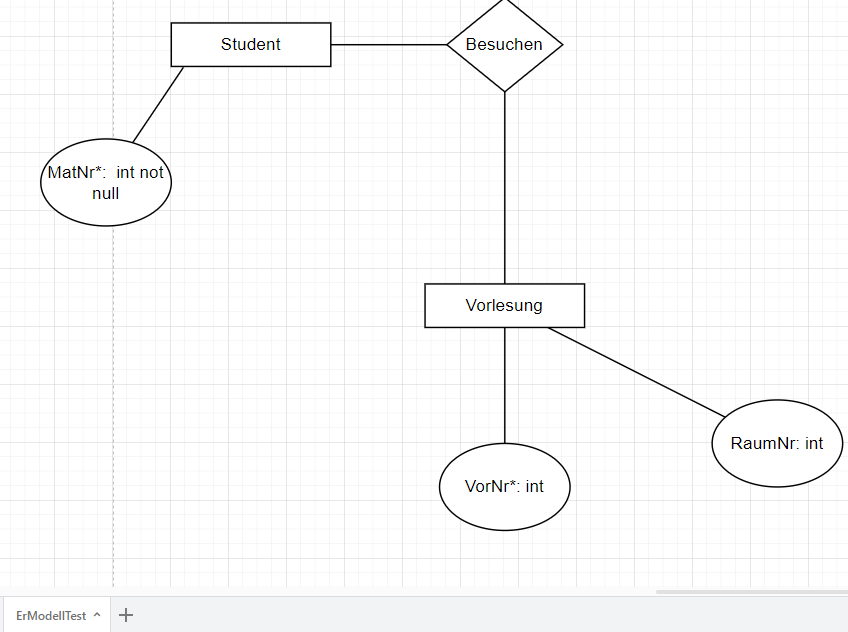

# ER-Modell-ToCode

Das **ER-Modell** beschreibt die Struktur von einer **Datenbank**. 
In diesem Projekt konstruieren wir einen Übersetzer, welcher ein 
**ER-Diagramm** in **SQL**-Code verwandelt.
## Inhatsverzeichniss

1. Quickstart
2. [FunktionsDoku](Doc/README.md)
3. Komplexe besipiele

## Quickstart
Wir beginnen mit dem folgenden Modell von **Vorlesungen** und **Studenten**. 

Diese entsrpicht einem ER-Modell siehe auch [Wikipedia](https://de.wikipedia.org/wiki/Entity-Relationship-Modell). Die Notation der 
Attribute ist an **SQL** angelehnt.

  
Der folgende Konsolen befehl ruft den **Übersetzer** auf .

    ErModellToCodeCreator.py ErModellTest.drawio ErModellTest

In dem Ordner **DataModell_ErModellTest** werden dann die folgenden 
**SQL-Skripts** generiert :

 **Relations_ErModellTest.sql**

    CREATE TABLE Besuchen (

    MatNr   int not null,
    VorNr  int

    ); 
In diesem wird die **Relation** umgesetzt, siehe Raute Diagramm.
  

**Tabels_ErModellTest.sql**

    CREATE TABLE Student (

    MatNr    int not null PRIMARY KEY

    ); 
              

    CREATE TABLE Vorlesung (

    VorNr   int PRIMARY KEY,
    RaumNr  int

    );   
Hier werden die **Tabellen** erstellt, siehe **Rechtecke**.
  
Diese beiden Skripte können nun zum erzeugen von Tabellen in **MSSQL** oder
**MySQl** verwendet werden.

## Literatur

**[1]  A.Kemper/A.Eickler; Datenbanksysteme, 5. auflage Oldenburhverlage**